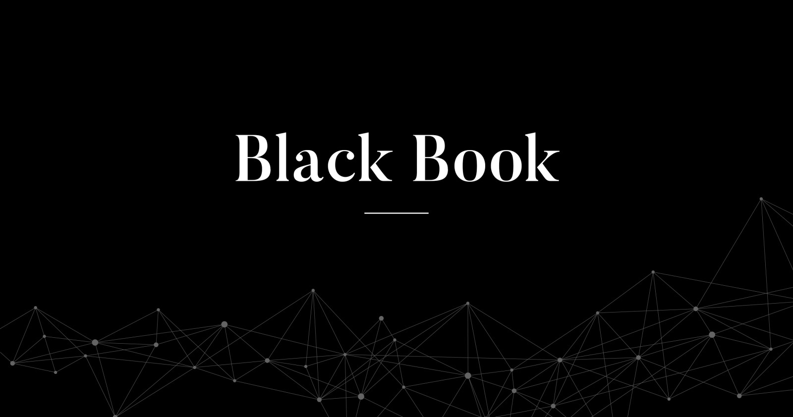

# BlackBook

<figure><figcaption></figcaption></figure>

## 들어가며

B1ackBook은 오펜시브 시큐리티 및 전반적인 정보보안과 관련된 TTP, 정보, 그리고 대응 방안을 공유하기 위해 만들어졌습니다. 사이버 보안과 관련해 영어권에서 만들어진 정보들은 많지만, 한글로 번역되거나 쓰여진 리소스들은 찾아보기 힘듭니다. IT업계에서 일하다보면 한글보다 영어가 편해진다곤 하지만, 모든 사람들이 능숙하게 영어를 읽고 쓰는 것은 아닙니다.

이 프로젝트는 부족한 한글 오펜시브 시큐리티 정보 문제를 해결하고 정보 공유를 더 원활하게 하기 위해 만들어졌습니다. 정보보안 업계 종사자들과 보안을 공부하는 학생들에게 도움이 되었으면 좋겠습니다.

## 주의사항

> 해당 프로젝트가 제공하는 모든 정보는 비상업적이고 개인적이거나 교육적인 용도를 위해서만 제공됩니다. 이 정보는 상업적 목적을 갖고 다운로드, 수정, 유통하는 등의 어떠한 방식으로도 사용할 수 없습니다.

> 해당 프로젝트는 제공된 정보에 대한 정확도, 완성도, 신뢰도를 보장하지 않습니다.

> 해당 프로젝트에 있는 모든 정보 (내용, 개념, 코드)는 이미 다른 사람들이 공개적으로 인터넷에 발표한 내용들이며, 실제 공격에 쓰일 수 없는 개념 증명(PoC)입니다. 해킹 공격으로 인한 법적인 책임은 모두 자신에게 있으며, 프로젝트 관리자는 이에 어떠한 책임도 지지 않습니다.

## 목표

* 업계 종사자들이 발표한 공격 기법을 공부하고 실습합니다.
* 한국의 정보보안 커뮤니티와 업계 종사자들이 편리하게 정보를 얻을 수 있는 위키를 구축합니다.

## 세부 프로젝트

* 레드팀: 공격자 시뮬레이션 (Adversary Simulation)에 관련된 전반적인 TTP 문서화
* 블루팀: Coming Soon - 전반적인 블루팀에 관련된 지식 문서화
* 주요정보통신기반시설 취약점 분석

## WhoAreYou?

업계에서 일하고 있는 현직 해커들로, 한국의 오펜시브 시큐리티 정보 공유에 기여하는 것을 지향합니다.

* [김도현 (B1ack Cat)](https://app.gitbook.com/u/aPZSpGSF3pQm3jdCberJxKOUHxx2 "mention") - 대학생이며 레드팀이 되기위해 노력중입니다.
  * [블로그](https://b1ackcat.com/)

###

## 레퍼런스 & 크레딧 (Reference & Credits)

이 프로젝트는 다음과 같은 업계 종사자들의 연구를 기반으로 만들어졌습니다. 이 프로젝트에 있는 모든 크레딧은 이들에게 돌립니다.&#x20;
